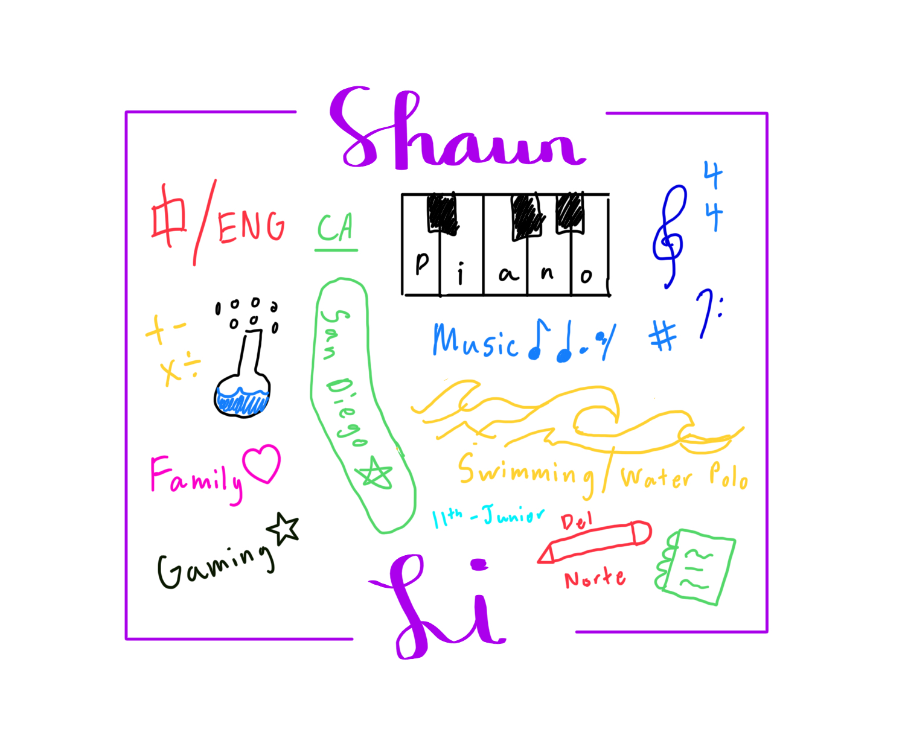

## Shaun Li | Period 3 CSSE
Welcome to my blog! This is my first time coding ever in my life but I am looking forward to updating my website with my ideas and creations. 

## [Subpages (WIP)](http://0.0.0.0:4200/student/schedule)

## Activities / Projects

⬇️⬇️⬇️ Freeform Picture Introduction ⬇️⬇️⬇️

## Lab Notebook (Timebox)

🌙 Week 0 - 8/16 to 8/18

✅ My Weekly Goal: Learn the basics of computer science and set up Visual Studio Code

📅 8/16: First day of school + Teacher/Course introduction

📅 8/17: Downloaded and set up Visual Studio Code + Freeform Picture

📅 8/18: Learned to run commands and set up Homebrew on Visual Studio Code

-----------------------------------------------------------------------------

🌙 Week 1 - 8/21 to 8/25

✅ My Weekly Goal: Set up Github Account/Page and Install Key Dependencies on Visual Studio Code

📅 8/21: Created Github account

📅 8/22: Set up terminal and created new repository

📅 8/23: Installed Ruby, Python, and Jupyter

📅 8/24: Ran version checks - Multiple errors found related to brew command

📅 8/25: Fixed brew error and ran Apple sillicon only error if Python fails

-----------------------------------------------------------------------------

🌙 Week 2 - 8/28 to 9/1

✅ My Weekly Goal: Set up my own blog site and learn to commit/sync changes

📅 8/28: Created blog site and learned how to commit changes

📅 8/29: Changed text and theme for website, also added Freeform picture to page

📅 8/31: Added snake game and altered text/color of game

📅 9/1: Started to create subpages on my website and added a basic calculator

-----------------------------------------------------------------------------

🌙 Week 2 - 9/5 to 9/8

✅ My Weekly Goal: Finish creating subpages and add more projects from teache repository

📅 9/5: Learned to create table from teacher repository and continued to work on subpages

📅 9/6: Transfered and added snake game to subpages

📅 9/7: 

📅 9/8: 

-----------------------------------------------------------------------------

## Snake Game

    <header class="pb-3 mb-4 border-bottom border-primary text-dark">
        
Score: 0

    </header>
    

        <!-- Main Menu -->
        

            
Welcome to Snake, press space (or press start) to begin wasting your time on this game that I probably copied and pasted from a website

            <a id="new_game" class="link-alert">start</a>
            <a id="setting_menu" class="link-alert">game settings</a>
        

        <!-- Game Over -->
        

            
skill issue u died, press Space to try again or use your time more wisely on something more productive

            <a id="new_game1" class="link-alert">waste more time playing this game</a>
            <a id="setting_menu1" class="link-alert">game settings</a>
        

        <!-- Play Screen -->
        <canvas id="snake" class="wrap" width="320" height="320" tabindex="1"></canvas>
        <!-- Settings Screen -->
        

            
Settings Screen, press space to go back to playing

            <a id="new_game2" class="link-alert">new game</a>
             
            
Speed:
                <input id="speed1" type="radio" name="speed" value="120" checked/>
                <label for="speed1">Slow</label>
                <input id="speed2" type="radio" name="speed" value="75"/>
                <label for="speed2">Normal</label>
                <input id="speed3" type="radio" name="speed" value="35"/>
                <label for="speed3">Fast</label>
            

            
Wall:
                <input id="wallon" type="radio" name="wall" value="1" checked/>
                <label for="wallon">On</label>
                <input id="walloff" type="radio" name="wall" value="0"/>
                <label for="walloff">Off</label>
            

        

    

-----------------------------------------------------------------------------

## Calculator

<html>
<head>
<meta charset="utf-8">
<title>JavaSctipt Calculator | Web Dev Trick</title>
	<link rel="stylesheet" href="style.css">
</head>
 
<body>
	
	

		<form name="form">
		

			<input type="text" placeholder="0" name="displayResult" />
		

			

			  

				<input type="button" name="b7" value="7" onClick="calcNumbers(b7.value)">
				  <input type="button" name="b8" value="8" onClick="calcNumbers(b8.value)">
				  <input type="button" name="b9" value="9" onClick="calcNumbers(b9.value)">
				  <input type="button" name="addb" value="+" onClick="calcNumbers(addb.value)">
				

				
				

				<input type="button" name="b4" value="4" onClick="calcNumbers(b4.value)">
				  <input type="button" name="b5" value="5" onClick="calcNumbers(b5.value)">
				  <input type="button" name="b6" value="6" onClick="calcNumbers(b6.value)">
				  <input type="button" name="subb" value="-" onClick="calcNumbers(subb.value)">
				

				
				

				<input type="button" name="b1" value="1" onClick="calcNumbers(b1.value)">
				  <input type="button" name="b2" value="2" onClick="calcNumbers(b2.value)">
				  <input type="button" name="b3" value="3" onClick="calcNumbers(b3.value)">
				  <input type="button" name="mulb" value="*" onClick="calcNumbers(mulb.value)">
				

				
				

				<input type="button" name="b0" value="0" onClick="calcNumbers(b0.value)">
				  <input type="button" name="potb" value="." onClick="calcNumbers(potb.value)">
				  <input type="button" name="divb" value="/" onClick="calcNumbers(divb.value)">
				  <input type="button" class="red" value="=" onClick="displayResult.value=eval(displayResult.value)">
				

			

		
		</form>
	

</body>
	
</html>

<h2>HTML Cell Output from Jupyter</h2>

<!-- Body contains the contents of the Document -->
<body>
    <table class="table">
        <thead>
            <tr>
                <th>Make</th>
                <th>Model</th>
                <th>Year</th>
                <th>Color</th>
                <th>Price</th>
            </tr>
        </thead>
        <tbody>
            <tr>
                <td>Ford</td>
                <td>Mustang</td>
                <td>2022</td>
                <td>Red</td>
                <td>$35,000</td>
            </tr>
            <tr>
                <td>Toyota</td>
                <td>Camry</td>
                <td>2022</td>
                <td>Silver</td>
                <td>$25,000</td>
            </tr>
            <tr>
                <td>Tesla</td>
                <td>Model S</td>
                <td>2022</td>
                <td>White</td>
                <td>$80,000</td>
            </tr>
            <tr>
                <td>Cadillac</td>
                <td>Broughan</td>
                <td>1969</td>
                <td>Black</td>
                <td>$10,000</td>
            </tr>
            <tr>
                <td>Ford</td>
                <td>F-350</td>
                <td>1997</td>
                <td>Green</td>
                <td>$15,000</td>
            </tr>
            <tr>
                <td>Ford</td>
                <td>Excursion</td>
                <td>2003</td>
                <td>Green</td>
                <td>$25,000</td>
            </tr>
            <tr>
                <td>Ford</td>
                <td>Ranger</td>
                <td>2012</td>
                <td>Red</td>
                <td>$8,000</td>
            </tr>
            <tr>
                <td>Kuboto</td>
                <td>L3301 Tractor</td>
                <td>2015</td>
                <td>Orange</td>
                <td>$12,000</td>
            </tr>
            <tr>
                <td>Ford</td>
                <td>Fusion Energi</td>
                <td>2015</td>
                <td>Guard</td>
                <td>$25,000</td>
            </tr>
            <tr>
                <td>Acura</td>
                <td>XL</td>
                <td>2006</td>
                <td>Grey</td>
                <td>$10,000</td>
            </tr>
            <tr>
                <td>Ford</td>
                <td>F150 Lightning</td>
                <td>2024</td>
                <td>Guard</td>
                <td>$70,000</td>
            </tr>
        </tbody>
    </table>
</body>